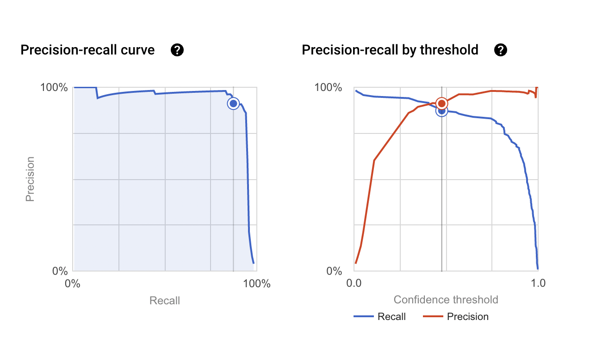
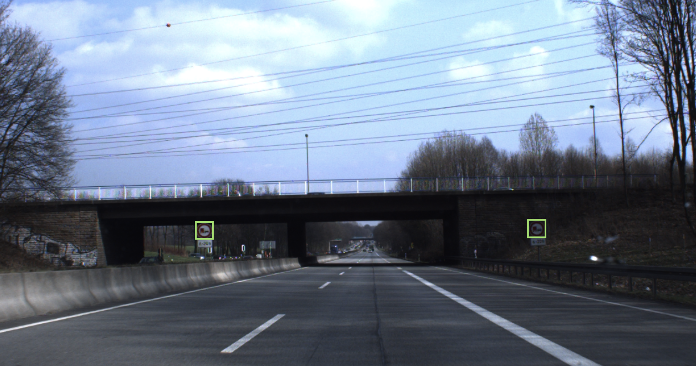
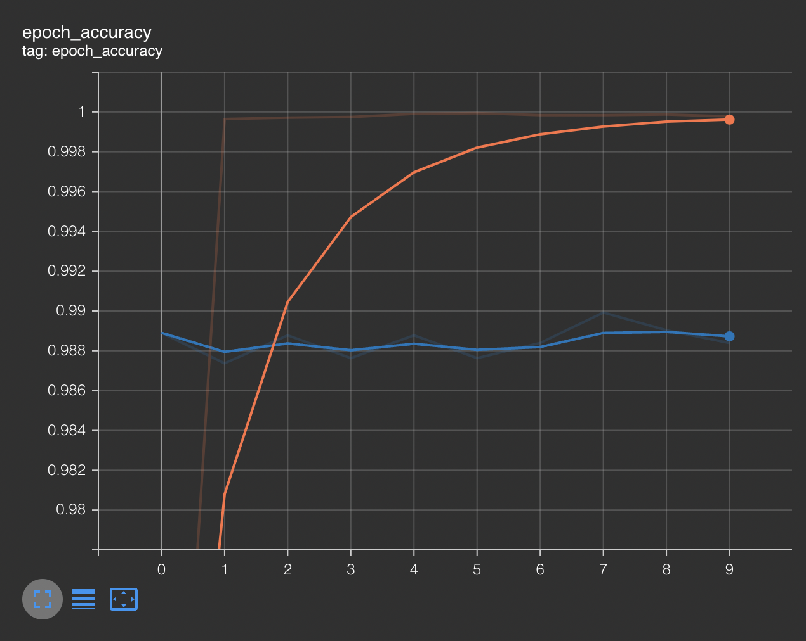
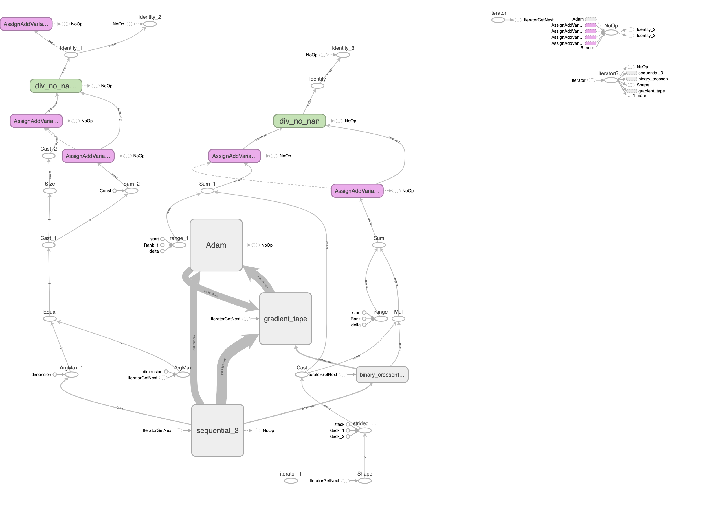

# Deep Learning Techniques Comparison for Road Sign Detection and Classification

In this project, we look to identify road signs and classify them. For this purpose, we have adopted two approaches. In the first we use AutoML on Google Cloud platform to create a system that can identify the road sign bounding box as well as the classified road sign. We explored several types of model configurations which vary in performance and latency. The second approach deals with classification using transfer learning. We experimented with three different architectures- ResNet50, Xception and InceptionResNetV2. We also tried using the pretrained weights and compared the training times and accuracies. These approaches highlight possible strategies to classify road signals for autonomous vehicles.


Expert systems, such as traffic assistance driving systems and automatic driving systems, rely heavily on traffic sign detection and identification. It immediately aids human and automated driving systems in effectively detecting and recognizing traffic signs. We look to utilize the various options GCP offers to perform deep learning operations as well. AutoML presents a clean and powerful tool for our purpose. We also covered various transfer learning techniques in class which we wanted to experiment with and observe the tradeoff between complexity of model, training time and accuracy. The German dataset of images was used to train the models.

## AutoML

Procedure - In order to train a model for the task of Image Object Detection of road signs, we decided to leverage the AutoML feature within the Vertex AI service provided by Google Cloud Platform. The first step involved preprocessing the GTSDB dataset and converting the images and corresponding labels (bounding boxes + class id) into an AutoML compatible format. For this, we first uploaded all images into a Cloud Storage Bucket and then created a CSV file linking the image URIs to the labels using the provided schema. Class balance was ensured by maintaining a uniform label ratio across the training, validation and test set. We trained two AutoML models (High Accuracy & Faster Predictions) which are supposed to be deployed using industrial GPUs and TPUs. Apart from these we trained three AutoML edge models (High Accuracy, Best trade-off and Fast Predictions) which are supposed to be deployed on the end device.
After training all 5 models, we evaluated their performance using Precision-Recall curves which are computed by Vertex AI’s AutoML platform and shall be shown later on in this presentation. The training time for each model has also been recorded to serve as an estimate for model size and complexity.

| Model | Training time | Precision | Recall | Latency |
| :---: | :---: | :---: | :---: | :---: |
|  Light model+Fast Prediction | 2 hours 28 minutes | 0.543 | 0.161 | 8ms (iPhone 10) |
|  Light model+ balanced trade off | 2 hours 59 minutes | 0.731 | 0.415 | 23ms (iPhone 10) |
|  Light model+high accuracy (slow prediction) | 2 hours 28 minutes | 0.953 | 0.686 | 34ms (iPhone 10) |
|  Net model+Fast Prediction | 3 hours 28 minutes | 0.912 | 0.873 | 300-500ms (Google TPU) |
|  Net model+high accuracy (slow) | 2 hours 19 minutes | 0.973 | 0.932 | 800-1500ms (Google TPU)|

Based on the table shown previously, we feel that the net model having faster predictions would be a good choice. It has high precision and recall as well as faster response which is crucial in this use case. The model has been deployed and can be used for prediction through the following command-

```
predict_image_object_detection_sample(
    project="170566775025",
    endpoint_id="5068774992326426624",
    location="us-central1",
    filename="YOUR_IMAGE_FILE"
)
```
### Model performance



Here is an example of the output generated by the model we consider the most suitable.. The bounding box is created in green and the model has correctly identified the road sign as ‘no overtaking’. It is a case of true positive




## Transfer Learning

Let us assume that the bounding box can be correctly identified using model architectures like YOLOv2 model. How do we then create a model that can perform the classification task as accurately and efficiently as possible. To accomplish this task, we experimented with three different transfer learning models namely - ResNet50, Xception and Inception-ResNetV2. Each of these models vary in complexity and performance. Using this architectures we trained six models. For each architecture, we trained a model and updated the weights within the architecture (imagenet) as well as a model where the pretrained weights were used along with a dense layer (whose weights were trained). This led to a reduced number of trainable parameters but we also lose the ability to adapt to our data better. We then created a dashboard using Tensorboard to visualize the growth and performance of the model.

Since we cannot observe the architecture for the AutoMl model, we will discuss the three transfer learning models we have employed-

1) Xception - There were 21 million trainable parameters for this model. It uses depthwise convolution which often results in better performance than Inception of which it is based. 

2) ResNet50 - There were 24 million parameters here. It is a 50 layer deep model. It has 49 conv layers, 1 max pooling and 1 average pooling layer.

3) Inception-ResNetV2 - We had 54 million parameters in this model. It has 148 layers which makes it the biggest model of the three. It is trained to classify images into 1000 classes.

The dataset used was the German Traffic Sign Recognition Dataset (GTSRB). It has 39209 images that have been split into 43 classes. We kept an 80-20 split for training and validation. Data augmentation was done as well to increase the generalization prowess of the model. We trained each model and employed a cyclical learning rate as well. The Adam optimizer was used for efficient convergence. We trained each model for 50 epochs and observed that there was no significant increase in validation accuracy after 10 epochs for the model with fixed weights. The retrainable model was trained up until convergence. We attached an early stopping callback to prevent overfitting as well. After logging the model history, we created a dashboard using tensorboard which can be observed within the notebook. Another model with the same architecture was created where the weights were not changed within the transfer learning architecture. The training time for all models was recorded for further analysis.

| Model | Number of parameters (trainable) | Training time (in seconds) | Validation accuracy |
| :---: | :---: | :---: | :---: | 
|  Resnet50 (trained) | 24,943,659 | 2257.88 [20 epochs] | 0.9784 | 
|  ResNet50(pretrained) | 1,409,067 | 908.98 [10 epochs] | 0.9092 | 
|  Xception (trained) | 21,599,571 | 2724.35 [20 epochs] | 0.9895 | 
|  Xception (pretrained) | 792,619 | 900 [10 epochs] | 0.9850 | 
|  Inception-ResNetV2 (trained) | 54,342,283 | 2521.96 [20 epochs] | 0.9913 | 
|  Inception-ResNetV2 (pretrained) | 66,091 | 976.02 [10 epochs] | 0.9899 | 

Based on the results we got, using a pretrained Inception-ResNetV2 makes sense. The number of parameters to be trained are a lot fewer and the accuracy was comparable to the retrained model. The epoch accuracies had been observed on tensorboard and shown below. The orange and blue curves represents training accuracy and validation accuracy respectively.





## Conclusion

To conclude we have presented several ways to accurately identify as well as classify road signals. The AutoML model was very effective in detecting the bounding box for each image as well classification. Transfer learning proved a viable way to perform the classification task after bounding box detection. In the future, we aim to create a custom model that is able to perform the task accomplished using AutoML in this project, whose architecture can be analyzed and improved upon. Such models have tremendous applications in autonomous driving and need to constantly be improved to ensure passenger safety.
